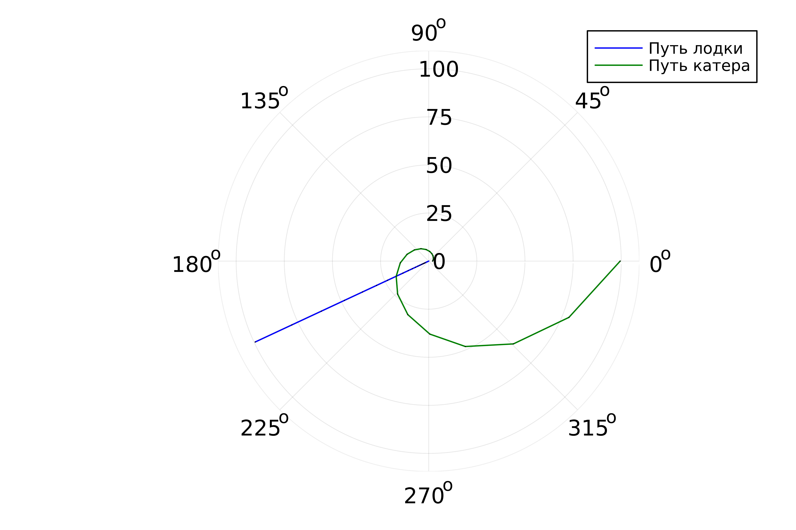

---
## Front matter
title: "Презентация №2"
subtitle: "Задача о погоне"
author: "Рытов Алексей Константинович"
lang: ru-RU

## Bibliography
bibliography: bib/cite.bib
csl: pandoc/csl/gost-r-7-0-5-2008-numeric.csl

## Pdf output format
toc-depth: 2
lof: true # List of figures
fontsize: 12pt
linestretch: 1.5
papersize: a4
documentclass: scrreprt
## I18n polyglossia
polyglossia-lang:
  name: russian
  options:
	- spelling=modern
	- babelshorthands=true
polyglossia-otherlangs:
  name: english
## I18n babel
babel-lang: russian
babel-otherlangs: english
## Fonts
mainfont: PT Serif
sansfont: PT Sans
monofont: PT Mono
mainfontoptions: Ligatures=TeX
romanfontoptions: Ligatures=TeX
sansfontoptions: Ligatures=TeX,Scale=MatchLowercase
monofontoptions: Scale=MatchLowercase,Scale=0.9
## Biblatex
biblatex: true
biblio-style: "gost-numeric"
biblatexoptions:
  - parentracker=true
  - backend=biber
  - hyperref=auto
  - language=auto
  - autolang=other*
  - citestyle=gost-numeric
## Pandoc-crossref LaTeX customization
figureTitle: "Рис."
tableTitle: "Таблица"
listingTitle: "Листинг"
lofTitle: "Список иллюстраций"
lotTitle: "Список таблиц"
lolTitle: "Листинги"
## Misc options
indent: true
header-includes:
  - \usepackage{indentfirst}
  - \usepackage{float} # keep figures where there are in the text
  - \floatplacement{figure}{H} # keep figures where there are in the text
---

# **Цель работы**

– Ознакомиться с языком julia
– Научиться решать задачу о погоне.

---

# Выполнение лабораторной работы

Мой вариант - 12. Значения k = 5,9; Vк = 1,9 * Vл;

1. Мы произвели необходимые расчеты, составили уравнение, решив которое мы получим
траекторию движения катера в полярных координатах, что и будет являться решением задачи о погоне.

---

2. Далее написали сскрипты для решения диф. уравнения и отрисовки результата на языке julia для первого и второго случая погони (рис. 1-2).  

  

---

---

Результаты выполнения скриптов представлены на рисунках 3-4.
 

---

---

# Вывод

Мы ознакомились с языком julia и научились решать задачу о погоне. 