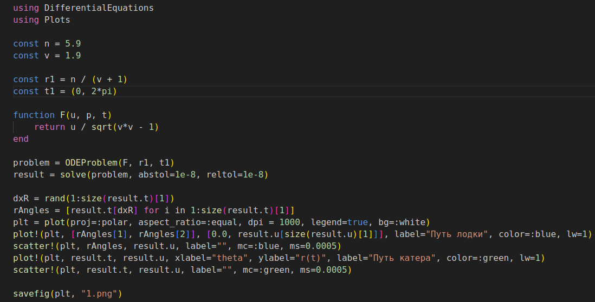
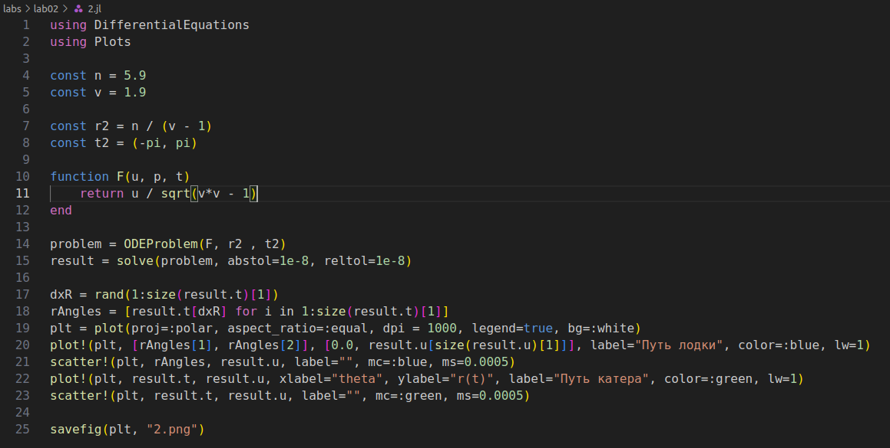
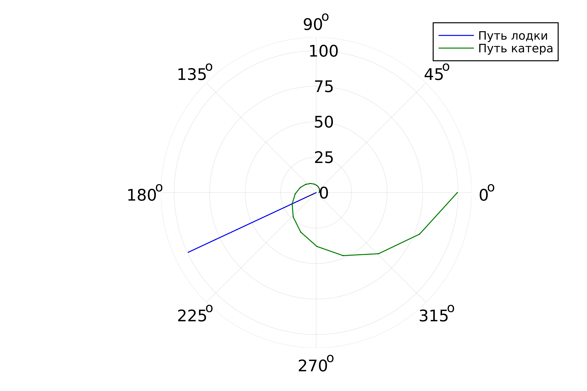
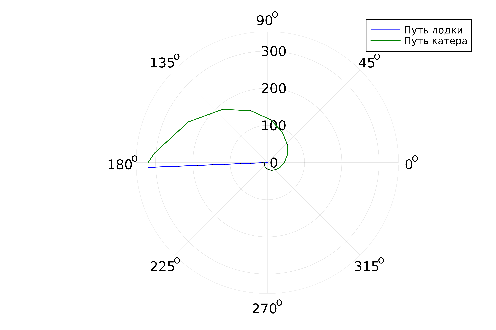

---
## Front matter
title: "Лабораторная работа №2"
subtitle: "Задача о погоне"
author: "Рытов Алексей Константинович"
lang: ru-RU

## Bibliography
bibliography: bib/cite.bib
csl: pandoc/csl/gost-r-7-0-5-2008-numeric.csl

## Pdf output format
toc-depth: 2
lof: true # List of figures
fontsize: 12pt
linestretch: 1.5
papersize: a4
documentclass: scrreprt
## I18n polyglossia
polyglossia-lang:
  name: russian
  options:
	- spelling=modern
	- babelshorthands=true
polyglossia-otherlangs:
  name: english
## I18n babel
babel-lang: russian
babel-otherlangs: english
## Fonts
mainfont: PT Serif
sansfont: PT Sans
monofont: PT Mono
mainfontoptions: Ligatures=TeX
romanfontoptions: Ligatures=TeX
sansfontoptions: Ligatures=TeX,Scale=MatchLowercase
monofontoptions: Scale=MatchLowercase,Scale=0.9
## Biblatex
biblatex: true
biblio-style: "gost-numeric"
biblatexoptions:
  - parentracker=true
  - backend=biber
  - hyperref=auto
  - language=auto
  - autolang=other*
  - citestyle=gost-numeric
## Pandoc-crossref LaTeX customization
figureTitle: "Рис."
tableTitle: "Таблица"
listingTitle: "Листинг"
lofTitle: "Список иллюстраций"
lotTitle: "Список таблиц"
lolTitle: "Листинги"
## Misc options
indent: true
header-includes:
  - \usepackage{indentfirst}
  - \usepackage{float} # keep figures where there are in the text
  - \floatplacement{figure}{H} # keep figures where there are in the text
---

# **Цель работы**

– Ознакомиться с языком julia
– Научиться решать задачу о погоне.

---

# Выполнение лабораторной работы

Мой вариант - 12. Значения k = 5,9; Vк = 1,9 * Vл;

1. Начальные координаты катера - (5,9; 0). Скорость лодки V, скорость катера 1,9V.
2. Траектория катера должна быть такой, чтобы и катер, и лодка все время
   были на одном расстоянии от полюса, только в этом случае траектория
   катера пересечется с траекторией лодки.
   Поэтому для начала катер береговой охраны должен двигаться некоторое
   время прямолинейно, пока не окажется на том же расстоянии от полюса, что
   и лодка браконьеров. После этого катер береговой охраны должен двигаться
   вокруг полюса удаляясь от него с той же скоростью, что и лодка
   браконьеров.
3. Чтобы найти расстояние x (расстояние после которого катер начнет
   двигаться вокруг полюса), необходимо составить простое уравнение. Пусть
   через время t катер и лодка окажутся на одном расстоянии x от полюса. За
   это время лодка пройдет x, а катер 5,9 - x (или 5,9 + x, в зависимости от
   начального положения катера относительно полюса). Время, за которое они
   пройдут это расстояние, вычисляется как $x/v$ или $(5,9 - x) \over 1,9v$ (во втором случае $(5,9 + x) \over 1,9v$). Так как время одно и то же, то эти величины одинаковы.
   Тогда неизвестное расстояниеx можно найти из следующего уравнения:
   $$ \left [\begin{array}{cl} {x \over v} = {{5,9 - x} \over {1,9v}} \\
   {x \over v} = {{5,9 + x} \over {1,9v}} \end{array} \right. $$

   Отсюда мы найдем два значения $x_1 = {59 \over 29}$, $x_2 = {59 \over 9}$, задачу будем решать для двух случаев.

4. После того, как катер береговой охраны окажется на одном расстоянии от
полюса, что и лодка, он должен сменить прямолинейную траекторию и
начать двигаться вокруг полюса удаляясь от него со скоростью лодки V.Для этого скорость катера раскладываем на радиальную и тангенцальную.

5. Решение исходной задачи сводится к решению системы из двух дифференциальных уравнений:
$$ \left\{ \begin{array}{cl} {dr \over dt} = v \\ {r * {d\theta \over dt}} = {{3*sqrt{29}} \over 10} * v \end{array} \right. $$

с начальными условиями

$$ \left\{ \begin{array}{cl} {\theta_0} = 0 \\ r_0 = {59 \over 29} \end{array} \right. $$
или
$$ \left\{ \begin{array}{cl} {\theta_0} = -\pi \\ r_0 = {59 \over 9} \end{array} \right. $$

Исключая из полученной системы производную по t, можно перейти к следующему уравнению:

${dr \over d\theta}$ = ${10r \over 3*sqrt{29}}$

Решив это уравнение, мы получим траекторию движения катера в полярных координатах.

Далее написали соотвествующий уравнению выше код на языке julia для первого и второго случая погони (рис. 1-2). 

  

  

Результаты выполнения скриптов представлены на рисунках 3-4.  

 

 

# Вывод

Мы ознакомились с языком julia и научились решать задачу о погоне. 
