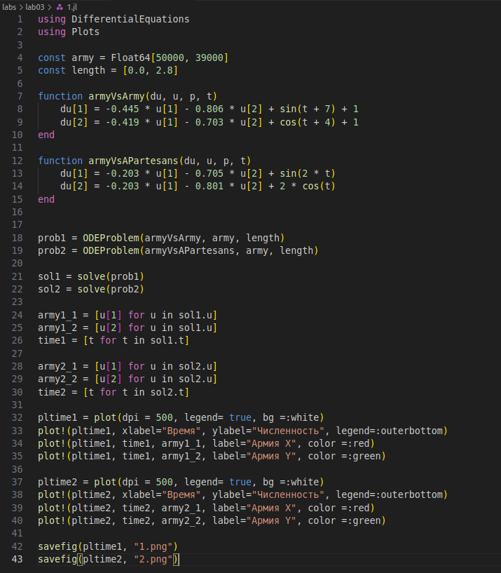
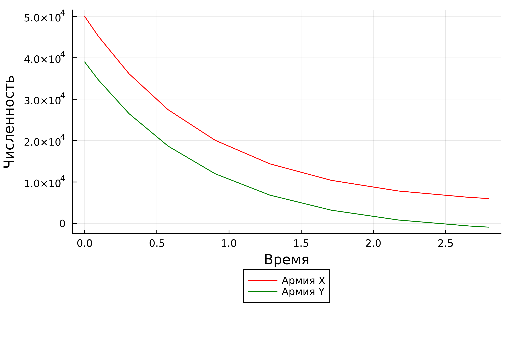
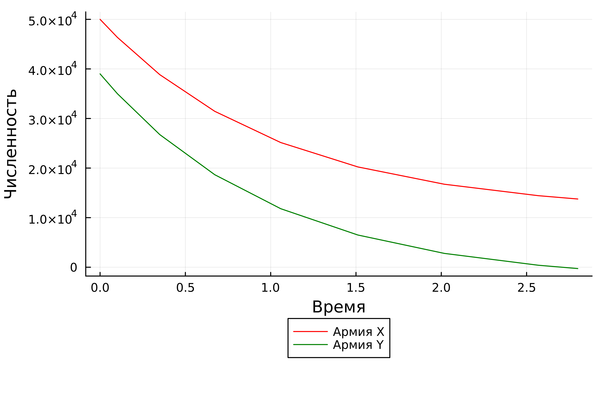

---
## Front matter
title: "Лабораторная работа №3"
subtitle: "Модель боевых действий"
author: "Рытов Алексей Константинович"
lang: ru-RU

## Bibliography
bibliography: bib/cite.bib
csl: pandoc/csl/gost-r-7-0-5-2008-numeric.csl

## Pdf output format
toc-depth: 2
lof: true # List of figures
fontsize: 12pt
linestretch: 1.5
papersize: a4
documentclass: scrreprt
## I18n polyglossia
polyglossia-lang:
  name: russian
  options:
	- spelling=modern
	- babelshorthands=true
polyglossia-otherlangs:
  name: english
## I18n babel
babel-lang: russian
babel-otherlangs: english
## Fonts
mainfont: PT Serif
sansfont: PT Sans
monofont: PT Mono
mainfontoptions: Ligatures=TeX
romanfontoptions: Ligatures=TeX
sansfontoptions: Ligatures=TeX,Scale=MatchLowercase
monofontoptions: Scale=MatchLowercase,Scale=0.9
## Biblatex
biblatex: true
biblio-style: "gost-numeric"
biblatexoptions:
  - parentracker=true
  - backend=biber
  - hyperref=auto
  - language=auto
  - autolang=other*
  - citestyle=gost-numeric
## Pandoc-crossref LaTeX customization
figureTitle: "Рис."
tableTitle: "Таблица"
listingTitle: "Листинг"
lofTitle: "Список иллюстраций"
lotTitle: "Список таблиц"
lolTitle: "Листинги"
## Misc options
indent: true
header-includes:
  - \usepackage{indentfirst}
  - \usepackage{float} # keep figures where there are in the text
  - \floatplacement{figure}{H} # keep figures where there are in the text
---

# Цель работы

Изучить модели боевых действий Ланчестера. Решить поставленную задачу с помощью языка julia.

# Выполнение лабораторной работы

## Задание

Между страной Х и страной У идет война. Численность состава войск исчисляется от начала войны, и являются временными функциями $x(t)$ и $y(t)$. В
начальный момент времени страна Х имеет армию численностью 50 000 человек, а в распоряжении страны У армия численностью в 39 000 человек. Для упрощения модели считаем, что коэффициенты $a$, $b$, $c$, $h$ постоянны. Также считаем $P(t)$ и $Q(t)$ непрерывными функциями. 

Постройте графики изменения численности войск армии Х и армии У для следующих случаев:

1. Модель боевых действий между регулярными войсками:

$$ {dx\over {dt}} = -0.445x(t)-0.806y(t)+sin(t+7)+1 $$
$$ {dy\over {dt}} = -0.419x(t)-0.703y(t)+cos(t+4)+1 $$

2. Модель ведение боевых действий с участием регулярных войск и партизанских отрядов:

$$ {dx\over {dt}} = -0.203x(t)-0.705y(t)+sin(2t) $$
$$ {dy\over {dt}} = -0.203x(t)y(t)-0.801y(t)+2cos(t) $$

## 1-ый случай 

Численность регулярных войск определяется тремя факторами:

1. Cкорость уменьшения численности войск из-за причин, не связанных с боевыми действиями (болезни, травмы, дезертирство);
2. Cкорость потерь, обусловленных боевыми действиями противоборствующих сторон (что связанно с качеством стратегии, уровнем вооружения, профессионализмом солдат и т.п.);
3. Cкорость поступления подкрепления (задаётся некоторой функцией от времени).

В этом случае модель боевых действий между регулярными войсками описывается следующим образом:

$$ {dx\over {dt}} = -a(t)x(t)-b(t)y(t)+P(t) $$
$$ {dy\over {dt}} = -c(t)x(t)-h(t)y(t)+Q(t) $$

В первом пункте нами рассматривается как раз такая модель. Она является доработанной моделью Ланчестера, так его изначальная модель учитывала лишь члены $b(t)y(t)$ и $c(t)x(t)$, то есть, на потери за промежуток времени влияли лишь численность армий и "эффективность оружия" (коэффициенты $b(t)$ и $c(t)$).

$$ {dx\over {dt}} = -ax(t)-by(t)+P(t) $$
$$ {dy\over {dt}} = -cx(t)-hy(t)+Q(t) $$

Именно эти уравнения и будут решать наши программы для выполнения первой части задания. В конце мы получим график кривой в декартовых координатах, где по оси $ox$ будет отображаться численность армии государства X, по оси $oy$ будет отображаться соответствующая численность армии Y. По тому, с какой осью пересечётся график, можно определить исход войны. Если ось $ox$ будет пересечена в положительных значениях, победа будет на стороне армии государства X (так как при таком раскладе численность армии Y достигла нуля при положительном значении численности армии X). Аналогичная ситуация для оси $oy$ и победы армии государства Y. 

## 2-ой случай

Для второй части задания, то есть, для моделирования боевых действий между регулярной армией и партизанской армией, необходимо внести поправки в предыдущую модель. Считается, что темп потерь партизан, проводящих свои операции в разных местах на некоторой известной территории, пропорционален не только численности армейских соединений, но и численности самих партизан.

$$ {dx\over {dt}} = -a(t)x(t)-b(t)y(t)+P(t) $$
$$ {dy\over {dt}} = -c(t)x(t)y(t)-h(t)y(t)+Q(t) $$

Коэффициенты $a$, $b$, $c$ и $h$ всё так же будут положительными десятичными числами:

$$ {dx\over {dt}} = -ax(t)-by(t)+P(t) $$
$$ {dy\over {dt}} = -cx(t)y(t)-hy(t)+Q(t) $$

По ходу работу мы написали следующий скрипт (рис. 1).

  

Полученные графики (рис 2-3).

  

  

# Вывод

Мы изучили модели боевых действий Ланчестера и решили поставленную задачу с помощью языка julia.