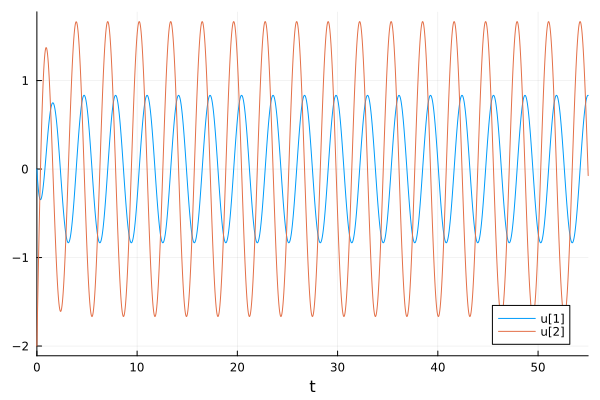

---
## Front matter
title: "Лабораторная работа №4"
subtitle: "Модель гармонических колебаний"
author: "Рытов Алексей Константинович"

## Bibliography
bibliography: bib/cite.bib
csl: pandoc/csl/gost-r-7-0-5-2008-numeric.csl

## Pdf output format
toc-depth: 2
fontsize: 12pt
linestretch: 1.5
papersize: a4
documentclass: scrreprt
## I18n polyglossia
polyglossia-lang:
  name: russian
  options:
	- spelling=modern
	- babelshorthands=true
polyglossia-otherlangs:
  name: english
## I18n babel
babel-lang: russian
babel-otherlangs: english
## Fonts
mainfont: PT Serif
sansfont: PT Sans
monofont: PT Mono
mainfontoptions: Ligatures=TeX
romanfontoptions: Ligatures=TeX
sansfontoptions: Ligatures=TeX,Scale=MatchLowercase
monofontoptions: Scale=MatchLowercase,Scale=0.9
## Biblatex
biblatex: true
biblio-style: "gost-numeric"
biblatexoptions:
  - parentracker=true
  - backend=biber
  - hyperref=auto
  - language=auto
  - autolang=other*
  - citestyle=gost-numeric
## Pandoc-crossref LaTeX customization
figureTitle: "Рис."
tableTitle: "Таблица"
listingTitle: "Листинг"
lofTitle: "Список иллюстраций"
lotTitle: "Список таблиц"
lolTitle: "Листинги"
## Misc options
indent: true
header-includes:
  - \usepackage{indentfirst}
  - \usepackage[utf8]{inputenc}
  - \usepackage[russian]{babel}
  - \usepackage{float} # keep figures where there are in the text
  - \floatplacement{figure}{H} # keep figures where there are in the text
---

# Цель работы

Изучить модель гармонического осцилятора. 


# Теоретическое введение

Движение грузика на пружинке, маятника, заряда в электрическом контуре, а также эволюция во времени многих систем в физике, химии, биологии и других науках при определенных предположениях можно описать одним и тем же дифференциальным уравнением, которое в теории колебаний выступает в качестве основной модели. Эта модель называется линейным гармоническим осциллятором.
Уравнение свободных колебаний гармонического осциллятора имеет следующий вид:
$$\ddot{x}+2\gamma\dot{x}+\omega_0^2=0$$

где $x$ - переменная, описывающая состояние системы (смещение грузика, заряд конденсатора и т.д.), $\gamma$ - параметр, характеризующий потери энергии (трение в механической системе, сопротивление в контуре), $\omega_0$ - собственная частота колебаний.
Это уравнение есть линейное однородное дифференциальное  уравнение второго порядка и оно является примером линейной динамической системы.

При отсутствии потерь в системе ( $\gamma=0$ ) получаем уравнение консервативного осциллятора энергия колебания которого сохраняется во времени.
$$\ddot{x}+\omega_0^2x=0$$

Для однозначной разрешимости уравнения второго порядка необходимо задать два начальных условия вида
 
$$
 \begin{cases}
	x(t_0)=x_0
	\\   
	\dot{x(t_0)}=y_0
 \end{cases}
$$

Уравнение второго порядка можно представить в виде системы двух уравнений первого порядка:
$$
 \begin{cases}
	x=y
	\\   
	y=-\omega_0^2x
 \end{cases}
$$

Начальные условия для системы примут вид:
$$
 \begin{cases}
	x(t_0)=x_0
	\\   
	y(t_0)=y_0
 \end{cases}
$$

Независимые	переменные	$x, y$	определяют	пространство,	в	котором «движется» решение. Это фазовое пространство системы, поскольку оно двумерно будем называть его фазовой плоскостью.

Значение фазовых координат $x, y$ в любой момент времени полностью определяет состояние системы. Решению уравнения движения как функции времени отвечает гладкая кривая в фазовой плоскости. Она называется фазовой траекторией. Если множество различных решений (соответствующих различным 
начальным условиям) изобразить на одной фазовой плоскости, возникает общая картина поведения системы. Такую картину, образованную набором фазовых траекторий, называют фазовым портретом.

# Задание

Вариант 12:

Постройте фазовый портрет гармонического осциллятора и решение уравнения гармонического осциллятора для следующих случаев:

1. Колебания гармонического осциллятора без затуханий и без действий внешней силы $\ddot{x}+4x=0$;
2. Колебания гармонического осциллятора c затуханием и без действий внешней силы $\ddot{x}+4\dot{x}+8x=0$
3. Колебания гармонического осциллятора c затуханием и под действием внешней силы $\ddot{x}+3\dot{x}+4x=5sin(2t)$

На интервале $t\in [0;55]$ (шаг $0.05$) с начальными условиями $x_0=0, y_0 = -2$


# Ход выполнения 

Написали скрипты на языках julia и openModelica для решения диф. уравнений.

```
using DifferentialEquations

function first(du, u, p, t)
    a = p[1]
    du[1] = u[2]
    du[2] = -a*u[1]
end

const x = 0
const y = -2
u0 = [x, y]

p = (4)
tspan = (0.0, 55.0)
prob = ODEProblem(first, u0, tspan, p)
sol = solve(prob, dtmax = 0.05)

using Plots; gr()

plot(sol)
savefig("1_1.png")

plot(sol, vars=(2,1))
savefig("1_2.png")
```

 </br>

 </br>

```
using DifferentialEquations

function first(du, u, p, t)
    a = p[1]
    b = p[2]

    du[1] = u[2]
    du[2] = -a*du[1] - b*u[1] 
end

const x = 0
const y = -2
u0 = [x, y]

p = (4, 8)
tspan = (0.0, 55.0)
prob = ODEProblem(first, u0, tspan, p)
sol = solve(prob)

using Plots; gr()

plot(sol)
savefig("2_1.png")

plot(sol, vars=(2,1))
savefig("2_2.png")
```

 </br>

 </br>

```
using DifferentialEquations

function first(du, u, p, t)
    a = p[1]
    b = p[2]

    du[1] = u[2]
    du[2] = -a*du[1] - b*u[1] + 5*sin(2*t)
end

const x = 0
const y = -2
u0 = [x, y]

p = (3, 4)
tspan = (0.0, 55.0)
prob = ODEProblem(first, u0, tspan, p)
sol = solve(prob)

using Plots; gr()

plot(sol)
savefig("3_1.png")

plot(sol, vars=(2,1))
savefig("3_2.png")
```

 </br>

 </br>

Листинги на OpenModelica.

```
model Lab4
model lab4_1
parameter Real w = sqrt(4);  
parameter Real g =0;  

parameter Real x0 = 0; 
parameter Real y0 = -2; 

Real x(start=x0); 
Real y(start=y0); 
// f(t)
function f 
input Real t ; 
output Real res; 
algorithm  
res := 0; 
end f; 

equation 
der(x) = y; 
der(y) = -w*w*x - g*y + f(time); 
end lab4_1;
  
  equation

annotation ( 
      experiment( 
        StopTime = 100  // Промежуток времени моделирования от 0 до 100 
      ) 
  );
    
end Lab4;
```

 </br>

```
model lab4_2
parameter Real w = sqrt(4);  
parameter Real g = 8;  

parameter Real x0 = 0; 
parameter Real y0 = -2; 

Real x(start=x0); 
Real y(start=y0); 
// f(t)
function f 
input Real t ; 
output Real res; 
algorithm  
res := 0; 
end f; 

equation 
der(x) = y; 
der(y) = -w*w*x - g + f(time); 

end lab4_2;
```

 </br>

```
model lab4_3
parameter Real w = sqrt(4);  
parameter Real g = 8;  

parameter Real x0 = 0; 
parameter Real y0 = -2; 

Real x(start=x0); 
Real y(start=y0); 

function f 
input Real t ; 
output Real res; 
algorithm  
res := 5 * sin(2 * t);
end f;  

equation 
der(x) = y; 
der(y) = -w*w*x - g*y - f(time); 

end lab4_3;
```

 </br>

# Вывод

Мы познакомились с моделью гармонических колебаний на практике.