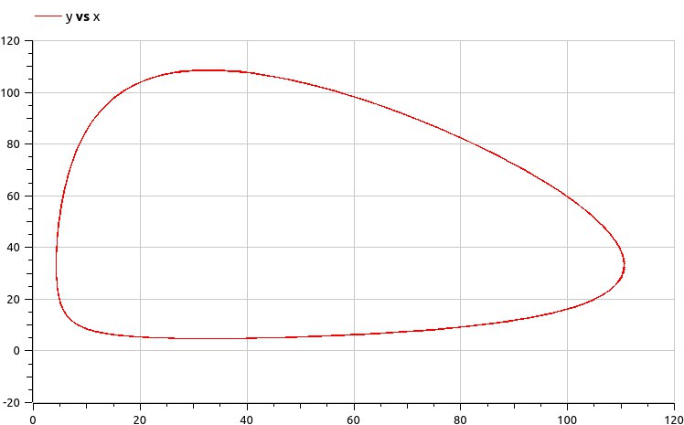

---
## Front matter
title: "Лабораторная работа №5"
subtitle: "Модель хищник-жертва"
author: "Рытов Алексей Константинович"

## Bibliography
bibliography: bib/cite.bib
csl: pandoc/csl/gost-r-7-0-5-2008-numeric.csl

## Pdf output format
toc-depth: 2
fontsize: 12pt
linestretch: 1.5
papersize: a4
documentclass: scrreprt
## I18n polyglossia
polyglossia-lang:
  name: russian
  options:
	- spelling=modern
	- babelshorthands=true
polyglossia-otherlangs:
  name: english
## I18n babel
babel-lang: russian
babel-otherlangs: english
## Fonts
mainfont: PT Serif
sansfont: PT Sans
monofont: PT Mono
mainfontoptions: Ligatures=TeX
romanfontoptions: Ligatures=TeX
sansfontoptions: Ligatures=TeX,Scale=MatchLowercase
monofontoptions: Scale=MatchLowercase,Scale=0.9
## Biblatex
biblatex: true
biblio-style: "gost-numeric"
biblatexoptions:
  - parentracker=true
  - backend=biber
  - hyperref=auto
  - language=auto
  - autolang=other*
  - citestyle=gost-numeric
## Pandoc-crossref LaTeX customization
figureTitle: "Рис."
tableTitle: "Таблица"
listingTitle: "Листинг"
lofTitle: "Список иллюстраций"
lotTitle: "Список таблиц"
lolTitle: "Листинги"
## Misc options
indent: true
header-includes:
  - \usepackage{indentfirst}
  - \usepackage[utf8]{inputenc}
  - \usepackage[russian]{babel}
  - \usepackage{float} # keep figures where there are in the text
  - \floatplacement{figure}{H} # keep figures where there are in the text
---

# Цель работы

Изучить жесткую модель хищник-жертва и построить эту модель.

# Теоретическое введение

- Модель Лотки—Вольтерры — модель взаимодействия двух видов типа «хищник — жертва», названная в честь её авторов, которые предложили модельные уравнения независимо друг от друга. Такие уравнения можно использовать для моделирования систем «хищник — жертва», «паразит — хозяин», конкуренции и других видов взаимодействия между двумя видами. [4]

Данная двувидовая модель основывается на
следующих предположениях [4]:

1. Численность популяции жертв x и хищников y зависят только от времени (модель не учитывает пространственное распределение популяции на занимаемой территории)

2. В отсутствии взаимодействия численность видов изменяется по модели Мальтуса, при этом число жертв увеличивается, а число хищников падает

3. Естественная смертность жертвы и естественная рождаемость хищника считаются несущественными

4. Эффект насыщения численности обеих популяций не учитывается

5. Скорость роста численности жертв уменьшается пропорционально численности хищников

$$
 \begin{cases}
	\frac{dx}{dt} = (-ax(t) + by(t)x(t))
	\\   
	\frac{dy}{dt} = (cy(t) - dy(t)x(t))
 \end{cases}
$$

В этой модели $x$ – число жертв, $y$ - число хищников.
Коэффициент $a$ описывает скорость естественного прироста числа жертв в отсутствие хищников, $с$ - естественное вымирание хищников, лишенных пищи в виде жертв.
Вероятность взаимодействия жертвы и хищника считается пропорциональной как количеству жертв, так и числу самих хищников ($xy$).
Каждый акт взаимодействия уменьшает популяцию жертв, но способствует увеличению популяции хищников (члены $-bxy$ и $dxy$ в правой части уравнения).

Математический анализ этой (жёсткой) модели показывает, что имеется стационарное состояние, всякое же другое начальное состояние приводит
к периодическому колебанию численности как жертв, так и хищников, так что по прошествии некоторого времени такая система вернётся в изначальное состояние.

Стационарное состояние системы (положение равновесия, не зависящее от времени решения) будет находиться
в точке $x_0=\frac{c}{d}, y_0=\frac{a}{b}$. Если начальные значения задать в стационарном состоянии $x(0) = x_0, y(0) = y_0$, то в любой момент времени
численность популяций изменяться не будет. При малом отклонении от положения равновесия численности как хищника, так и жертвы с течением времени не
возвращаются к равновесным значениям, а совершают периодические колебания вокруг стационарной точки. Амплитуда колебаний и их период определяется
начальными значениями численностей $x(0), y(0)$. Колебания совершаются в противофазе.

# Задачи

1. Построить график зависимости численности хищников от численности жертв

2. Построить график зависимости численности хищников и численности жертв от времени

3. Найти стационарное состояние системы

# Задание

Вариант 12:

Для модели «хищник-жертва»:

$$
 \begin{cases}
	\frac{dx}{dt} = -0.24x(t) + 0.044y(t)x(t)
	\\   
	\frac{dy}{dt} = 0.44y(t) - 0.024y(t)x(t)
 \end{cases}
$$

Постройте график зависимости численности хищников от численности жертв, а также графики изменения численности хищников и численности жертв 
при следующих начальных условиях: $x_0=4, y_0=10$
Найдите стационарное состояние системы.

# Выполнение лабораторной работы

Написали скрипты на языках julia и openModelica для решения диф. уравнений.

```
using DifferentialEquations
using Plots

a = 0.24
b = 0.044
c = 0.44
d = 0.024

function func(du, u, p, t)
    x, y = u
    du[1] = -a * u[1] + b * u[1] * u[2]
    du[2] = c * u[2] - d * u[2] * u[1]
end

v0 = [4, 10]
tspan = (0.0, 60.0)

prob = ODEProblem(func, v0, tspan)
sol = solve(prob, dtmax=0.05)

X = [u[1] for u in sol.u]
Y = [u[2] for u in sol.u]
T = [t for t in sol.t]

plt1 = plot(dpi=300,legend=false)
plot!(plt1, X, Y, color=:blue)
savefig(plt1, "1.png")

plt2 = plot(dpi=300,legend=true)
plot!(plt2, T, X, label="Численность жертв", color=:red)
plot!(plt2, T, Y, label="Численность хищников", color=:green)
savefig(plt2, "2.png")

v1 = [c/d, a/b]


prob1 = ODEProblem(func, v1, tspan)
sol1 = solve(prob1, dtmax=0.05)

X1 = [u[1] for u in sol1.u]
Y1 = [u[2] for u in sol1.u]
T1 = [t for t in sol1.t]

plt3 = plot(dpi=300,legend=true)
plot!(plt3, T1, X1, label="Численность жертв", color=:red)
plot!(plt3, T1, Y1, label="Численность хищников", color=:green)
savefig(plt3, "3.png")
```


```
model lab05_1
Real a = 0.24;
Real b = 0.044;
Real c = 0.44;
Real d = 0.024;
Real x;
Real y;
initial equation
x = 4;
y = 10;
equation
der(x) = -a*x + b*x*y;
der(y) = c*y - d*x*y;
end lab05_1;
```

```
model lab05_2
Real a = 0.24;
Real b = 0.044;
Real c = 0.44;
Real d = 0.024;
Real x;
Real y;
initial equation
x = c / d;
y = a / b;
equation
der(x) = -a*x + b*x*y;
der(y) = c*y - d*x*y;
end lab05_2;
```



# Вывод

Мы изучили модель хищник-жертва.
