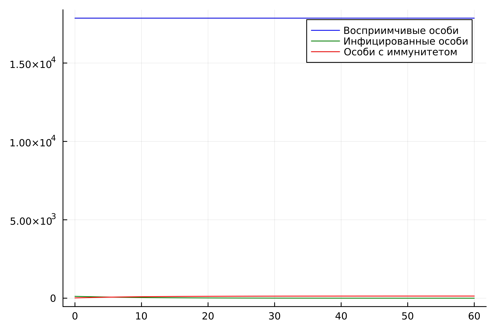

---
## Front matter
lang: ru-RU
title: Модель эпидемии
author: |
	 Рытов Алексей

institute: |
	Российский Университет Дружбы Народов

date: 18 февраля, 2024, Москва, Россия

## Formatting
mainfont: PT Serif
romanfont: PT Serif
sansfont: PT Sans
monofont: PT Mono
toc: false
slide_level: 2
theme: metropolis
header-includes: 
 - \metroset{progressbar=frametitle,sectionpage=progressbar,numbering=fraction}
 - '\makeatletter'
 - '\beamer@ignorenonframefalse'
 - '\makeatother'
aspectratio: 43
section-titles: true

---

# Цель работы

Изучить и построить модель эпидемии.

# Теоретическое введение. Построение математической модели.

Рассмотрим простейшую модель эпидемии. Предположим, что некая популяция, состоящая из $N$ особей, (считаем, что популяция изолирована) подразделяется на три группы. Первая группа - это восприимчивые к болезни, но пока здоровые особи, обозначим их через $S(t)$. Вторая группа – это число инфицированных особей, которые также при этом являются распространителями инфекции, обозначим их $I(t)$. А третья группа, обозначающаяся через $R(t)$ – это здоровые особи с иммунитетом к болезни. 

---

До того, как число заболевших не превышает критического значения $I^*$, считаем, что все больные изолированы и не заражают здоровых. Когда $I(t)> I^*$, тогда инфицирование способны заражать восприимчивых к болезни особей. 

Таким образом, скорость изменения числа $S(t)$ меняется по следующему закону:

$$
\frac{dS}{dt}=
 \begin{cases}
	-\alpha S &\text{,если $I(t) > I^*$}
	\\   
	0 &\text{,если $I(t) \leq I^*$}
 \end{cases}
$$

---

Поскольку каждая восприимчивая к болезни особь, которая, в конце концов, заболевает, сама становится инфекционной, то скорость изменения числа инфекционных особей представляет разность за единицу времени между заразившимися и теми, кто уже болеет и лечится, то есть:

$$
\frac{dI}{dt}=
 \begin{cases}
	\alpha S -\beta I &\text{, если $I(t) > I^*$}
	\\   
	-\beta I &\text{, если $I(t) \leq I^*$}
 \end{cases}
$$

---

А скорость изменения выздоравливающих особей (при этом приобретающие иммунитет к болезни):

$$\frac{dR}{dt} = \beta I$$

Постоянные пропорциональности $\alpha, \beta$ - это коэффициенты заболеваемости и выздоровления соответственно. Для того, чтобы решения соответствующих уравнений определялось однозначно, необходимо задать начальные условия. Считаем, что на начало эпидемии в момент времени $t=0$ нет особей с иммунитетом к болезни $R(0)=0$, а число инфицированных и восприимчивых к болезни особей $I(0)$ и $S(0)$ соответственно. Для анализа картины протекания эпидемии необходимо рассмотреть два случая:  $I(0) \leq I^*$ и  $I(0)>I^*$

# Задание

**Вариант 12**

На одном острове вспыхнула эпидемия. Известно, что из всех проживающих на острове 
$(N=18000)$ в момент начала эпидемии $(t=0)$ число заболевших людей 
(являющихся распространителями инфекции) $I(0)=118$, А число здоровых людей с иммунитетом 
к болезни $R(0)=18$. Таким образом, число людей восприимчивых к болезни, 
но пока здоровых, в начальный момент времени $S(0)=N-I(0)-R(0)$.
Постройте графики изменения числа особей в каждой из трех групп.

---

Рассмотрите, как будет протекать эпидемия в случае:

1.	$I(0)\leq I^*$

2.	$I(0)>I^*$

# Задачи

Построить графики изменения числа особей в каждой из трех групп $S$, $I$, $R$. Рассмотреть, как будет протекать эпидемия в случаях:

1.	$I(0)\leq I^*$

2.	$I(0)>I^*$

# Выполнение лабораторной работы

Написали скрипты на языках julia и openModelica для решения диф. уравнений.

---

---

---

# Вывод

Мы изучили модель эпидемии.