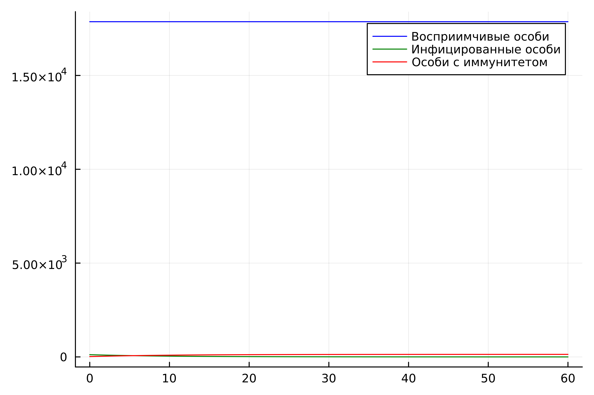
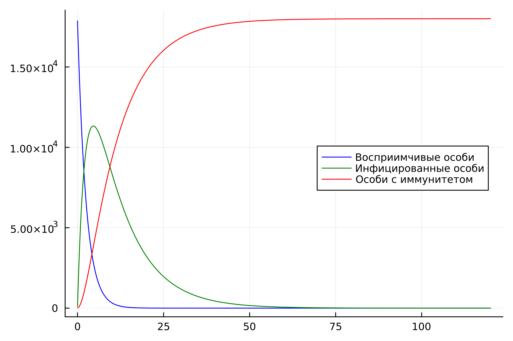

---
## Front matter
title: "Лабораторная работа №6"
subtitle: "Модель эпидемии"
author: "Рытов Алексей Константинович"

## Bibliography
bibliography: bib/cite.bib
csl: pandoc/csl/gost-r-7-0-5-2008-numeric.csl

## Pdf output format
toc-depth: 2
fontsize: 12pt
linestretch: 1.5
papersize: a4
documentclass: scrreprt
## I18n polyglossia
polyglossia-lang:
  name: russian
  options:
	- spelling=modern
	- babelshorthands=true
polyglossia-otherlangs:
  name: english
## I18n babel
babel-lang: russian
babel-otherlangs: english
## Fonts
mainfont: PT Serif
sansfont: PT Sans
monofont: PT Mono
mainfontoptions: Ligatures=TeX
romanfontoptions: Ligatures=TeX
sansfontoptions: Ligatures=TeX,Scale=MatchLowercase
monofontoptions: Scale=MatchLowercase,Scale=0.9
## Biblatex
biblatex: true
biblio-style: "gost-numeric"
biblatexoptions:
  - parentracker=true
  - backend=biber
  - hyperref=auto
  - language=auto
  - autolang=other*
  - citestyle=gost-numeric
## Pandoc-crossref LaTeX customization
figureTitle: "Рис."
tableTitle: "Таблица"
listingTitle: "Листинг"
lofTitle: "Список иллюстраций"
lotTitle: "Список таблиц"
lolTitle: "Листинги"
## Misc options
indent: true
header-includes:
  - \usepackage{indentfirst}
  - \usepackage[utf8]{inputenc}
  - \usepackage[russian]{babel}
  - \usepackage{float} # keep figures where there are in the text
  - \floatplacement{figure}{H} # keep figures where there are in the text
---

# Цель работы

Изучить и построить модель эпидемии.

# Теоретическое введение. Построение математической модели.

Рассмотрим простейшую модель эпидемии. Предположим, что некая популяция, состоящая из $N$ особей, (считаем, что популяция изолирована) подразделяется на три группы. Первая группа - это восприимчивые к болезни, но пока здоровые особи, обозначим их через $S(t)$. Вторая группа – это число инфицированных особей, которые также при этом являются распространителями инфекции, обозначим их $I(t)$. А третья группа, обозначающаяся через $R(t)$ – это здоровые особи с иммунитетом к болезни. 
До того, как число заболевших не превышает критического значения $I^*$, считаем, что все больные изолированы и не заражают здоровых. Когда $I(t)> I^*$, тогда инфицирование способны заражать восприимчивых к болезни особей. 

Таким образом, скорость изменения числа $S(t)$ меняется по следующему закону:

$$
\frac{dS}{dt}=
 \begin{cases}
	-\alpha S &\text{,если $I(t) > I^*$}
	\\   
	0 &\text{,если $I(t) \leq I^*$}
 \end{cases}
$$

Поскольку каждая восприимчивая к болезни особь, которая, в конце концов, заболевает, сама становится инфекционной, то скорость изменения числа инфекционных особей представляет разность за единицу времени между заразившимися и теми, кто уже болеет и лечится, то есть:

$$
\frac{dI}{dt}=
 \begin{cases}
	\alpha S -\beta I &\text{, если $I(t) > I^*$}
	\\   
	-\beta I &\text{, если $I(t) \leq I^*$}
 \end{cases}
$$

А скорость изменения выздоравливающих особей (при этом приобретающие иммунитет к болезни):

$$\frac{dR}{dt} = \beta I$$

Постоянные пропорциональности $\alpha, \beta$ - это коэффициенты заболеваемости и выздоровления соответственно. Для того, чтобы решения соответствующих уравнений определялось однозначно, необходимо задать начальные условия. Считаем, что на начало эпидемии в момент времени $t=0$ нет особей с иммунитетом к болезни $R(0)=0$, а число инфицированных и восприимчивых к болезни особей $I(0)$ и $S(0)$ соответственно. Для анализа картины протекания эпидемии необходимо рассмотреть два случая:  $I(0) \leq I^*$ и  $I(0)>I^*$

# Задание

**Вариант 12**

На одном острове вспыхнула эпидемия. Известно, что из всех проживающих на острове 
$(N=18000)$ в момент начала эпидемии $(t=0)$ число заболевших людей 
(являющихся распространителями инфекции) $I(0)=118$, А число здоровых людей с иммунитетом 
к болезни $R(0)=18$. Таким образом, число людей восприимчивых к болезни, 
но пока здоровых, в начальный момент времени $S(0)=N-I(0)-R(0)$.
Постройте графики изменения числа особей в каждой из трех групп.

Рассмотрите, как будет протекать эпидемия в случае:

1.	$I(0)\leq I^*$

2.	$I(0)>I^*$

# Задачи

Построить графики изменения числа особей в каждой из трех групп $S$, $I$, $R$. Рассмотреть, как будет протекать эпидемия в случаях:

1.	$I(0)\leq I^*$

2.	$I(0)>I^*$

# Выполнение лабораторной работы

Написали скрипты на языках julia и openModelica для решения диф. уравнений.


```
using DifferentialEquations
using Plots

beta = 0.1

function f(du, u, p, t)
    S, I, R = u
    du[1] = 0
    du[2] = -beta*u[2]
    du[3] = beta*I
end

N = 18000
I0 = 118
R0 = 18
S0 = N - I0 - R0

v0 = [S0, I0, R0]
tspan = (0.0, 60.0)
prob =ODEProblem(f, v0, tspan)
sol = solve(prob, dtmax = 0.1)

S = [u[1] for u in sol.u]
I = [u[2] for u in sol.u]
R = [u[3] for u in sol.u]
T = [t for t in sol.t]

plt1 = plot(dpi=600,legend=:topright)
plot!(plt1, T, S, label = "Восприимчивые особи", color=:blue)
plot!(plt1, T, I, label = "Инфицированные особи", color=:green)
plot!(plt1, T, R, label = "Особи с иммунитетом", color=:red)
savefig(plt1, "1.png")
```



---

```
using Plots
using DifferentialEquations

N = 18000
I0 = 118
R0 = 18
S0 = N - I0 - R0

alpha = 0.4
beta = 0.1

function ode_fn(du, u, p, t)
    S, I, R = u
    du[1] = -alpha*u[1]
    du[2] = alpha*u[1] - beta*u[2]
    du[3] = beta*I
end

v0 = [S0, I0, R0]
tspan = (0.0, 120.0)
prob = ODEProblem(ode_fn, v0, tspan)
sol = solve(prob, dtmax=0.05)
S = [u[1] for u in sol.u]
I = [u[2] for u in sol.u]
R = [u[3] for u in sol.u]
T = [t for t in sol.t]

plt = plot(
  dpi=600,
  legend=:right)

plot!(
  plt,
  T,
  S,
  label="Восприимчивые особи",
  color=:blue)
plot!(
  plt,
  T,
  I,
  label="Инфицированные особи",
  color=:green)
plot!(
  plt,
  T,
  R,
  label="Особи с иммунитетом",
  color=:red)


savefig(plt, "2.png")
```



---

```
model lab06_1
Real N = 18000;
Real I;
Real R;
Real S;
Real alpha = 0.6;
Real beta = 0.2;
initial equation
I = 118;
R = 18;
S = N - I - R;
equation
der(S) = 0;
der(I) = -beta*I;
der(R) = beta*I;
end lab06_1;
```


---

```
model lab06_2
Real N = 18000;
Real I;
Real R;
Real S;
Real alpha = 0.4;
Real beta = 0.1;
initial equation
I = 118;
R = 18;
S = N - I - R;
equation
der(S) = -alpha*S;
der(I) = alpha*S - beta*I;
der(R) = beta*I;
end lab06_2;
```


# Вывод

Мы изучили модель эпидемии.