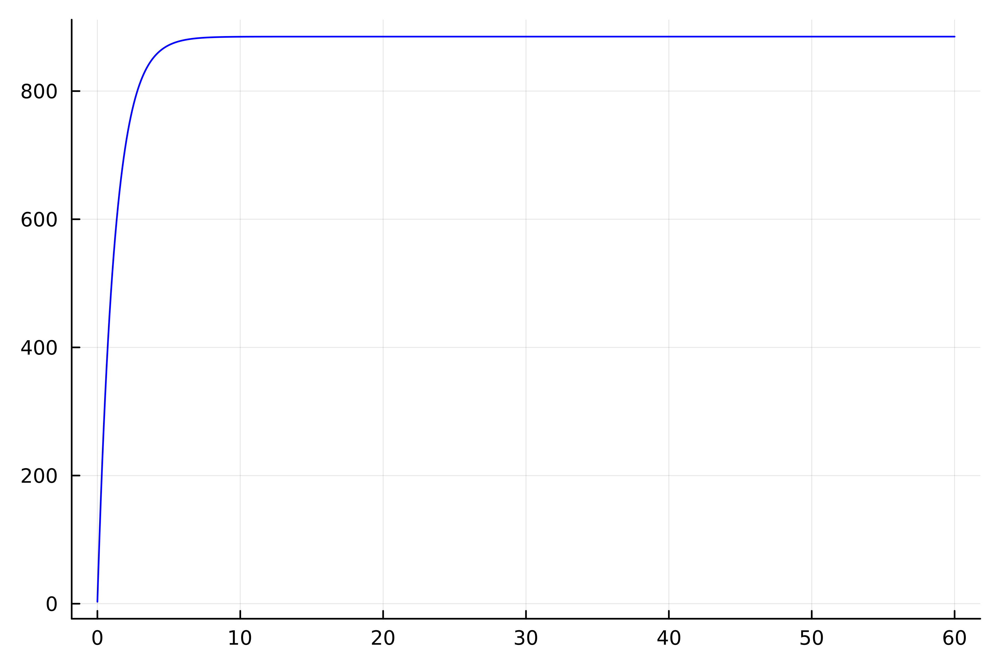
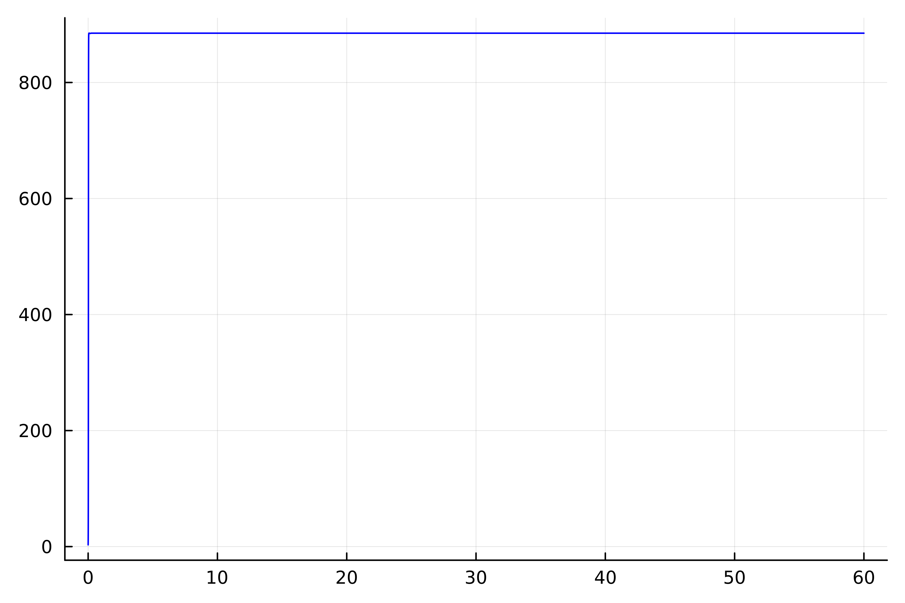
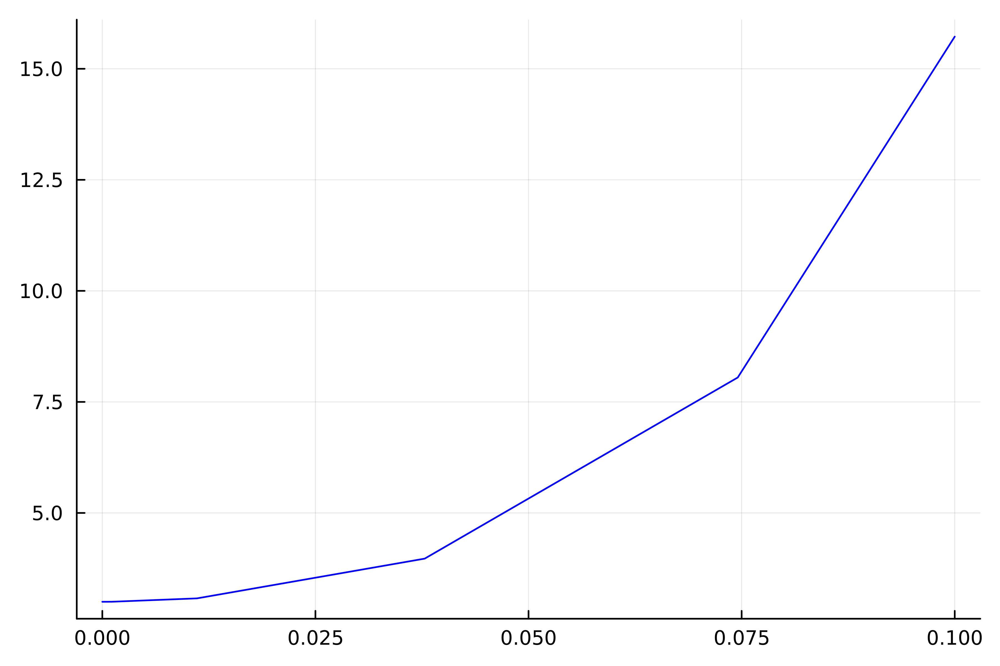
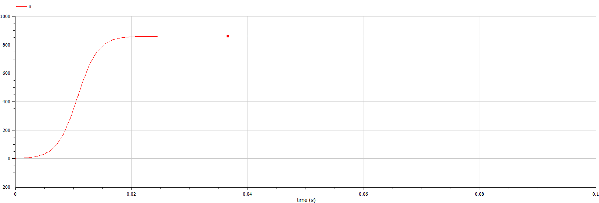
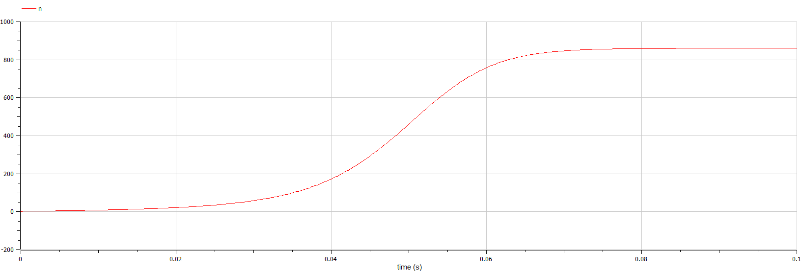

---
## Front matter
lang: ru-RU
title: Модель распространения рекламы
author: |
	 Рытов Алексей

institute: |
	Российский Университет Дружбы Народов

date: 18 февраля, 2024, Москва, Россия

## Formatting
mainfont: PT Serif
romanfont: PT Serif
sansfont: PT Sans
monofont: PT Mono
toc: false
slide_level: 2
theme: metropolis
header-includes: 
 - \metroset{progressbar=frametitle,sectionpage=progressbar,numbering=fraction}
 - '\makeatletter'
 - '\beamer@ignorenonframefalse'
 - '\makeatother'
aspectratio: 43
section-titles: true

---

# Цель работы

Изучить и построить модель эффективности рекламы.

# Теоретическое введение. Построение математической модели.

Математическая модель распространения рекламы описывается уравнением:

$$\frac{dn}{dt} = (\alpha _1(t) + \alpha _2(t)n(t))(N-n(t))$$

При $\alpha _1(t) >> \alpha _2(t)$ получается модель типа модели Мальтуса

В обратном случае $\alpha _1(t) << \alpha _2(t)$ получаем уравнение логистической кривой

# Задание

**Вариант 12**

Постройте график распространения рекламы, математическая модель которой описывается следующим уравнением:

1.	$\frac{dn}{dt} = (0.83 + 0.000013n(t))(N-n(t))$
2.	$\frac{dn}{dt} = (0.000024 + 0.29n(t))(N-n(t))$
3.	$\frac{dn}{dt} = (0.5t + 0.3t  n(t))(N-n(t))$

При этом объем аудитории $N = 885$, в начальный момент о товаре знает 3 человек.

Для случая 2 определите в какой момент времени скорость распространения рекламы будет иметь максимальное значение.

# Выполнение лабораторной работы

Написали скрипты на языках julia и openModelica для решения диф. уравнений.

---

---

---

---

---

# Вывод 

Мы изучили и построили модель эффективности рекламы.