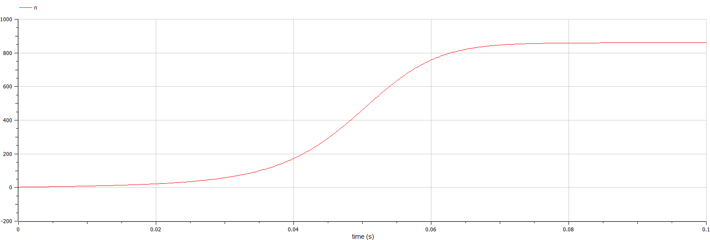

---
## Front matter
title: "Отчёт по лабораторной работе №7"
subtitle: "Модель распространения рекламы"
author: "Рытов Алексей Константинович"

## Bibliography
bibliography: bib/cite.bib
csl: pandoc/csl/gost-r-7-0-5-2008-numeric.csl

## Pdf output format
toc-depth: 2
fontsize: 12pt
linestretch: 1.5
papersize: a4
documentclass: scrreprt
## I18n polyglossia
polyglossia-lang:
  name: russian
  options:
	- spelling=modern
	- babelshorthands=true
polyglossia-otherlangs:
  name: english
## I18n babel
babel-lang: russian
babel-otherlangs: english
## Fonts
mainfont: PT Serif
sansfont: PT Sans
monofont: PT Mono
mainfontoptions: Ligatures=TeX
romanfontoptions: Ligatures=TeX
sansfontoptions: Ligatures=TeX,Scale=MatchLowercase
monofontoptions: Scale=MatchLowercase,Scale=0.9
## Biblatex
biblatex: true
biblio-style: "gost-numeric"
biblatexoptions:
  - parentracker=true
  - backend=biber
  - hyperref=auto
  - language=auto
  - autolang=other*
  - citestyle=gost-numeric
## Pandoc-crossref LaTeX customization
figureTitle: "Рис."
tableTitle: "Таблица"
listingTitle: "Листинг"
lofTitle: "Список иллюстраций"
lotTitle: "Список таблиц"
lolTitle: "Листинги"
## Misc options
indent: true
header-includes:
  - \usepackage{indentfirst}
  - \usepackage[utf8]{inputenc}
  - \usepackage[russian]{babel}
  - \usepackage{float} # keep figures where there are in the text
  - \floatplacement{figure}{H} # keep figures where there are in the text
---

# Цель работы

Изучить и построить модель эффективности рекламы.

# Теоретическое введение. Построение математической модели.

Организуется рекламная кампания нового товара или услуги. Необходимо, чтобы прибыль будущих продаж с избытком покрывала издержки на рекламу. Вначале расходы могут превышать прибыль, поскольку лишь малая часть потенциальных покупателей будет информирована о новинке. Затем, при увеличении числа продаж, возрастает и прибыль, и, наконец, наступит момент, когда рынок насытиться, и рекламировать товар станет бесполезным.

Предположим, что торговыми учреждениями реализуется некоторая продукция, о которой в момент времени $t$ из числа потенциальных покупателей $N$ знает лишь $n$ покупателей. Для ускорения сбыта продукции запускается реклама по радио, телевидению и других средств массовой информации. После запуска рекламной кампании информация о продукции начнет распространяться среди потенциальных покупателей путем общения друг с другом. Таким образом, после запуска рекламных объявлений скорость изменения числа знающих о продукции людей пропорциональна как числу знающих о товаре покупателей, так и числу покупателей о нем не знающих

Модель рекламной кампании описывается следующими величинами.
Считаем, что $\frac{dn}{dt}$ - скорость изменения со временем числа потребителей, узнавших о товаре и готовых его купить,
$t$ - время, прошедшее с начала рекламной кампании,
$N$ - общее число потенциальных платежеспособных покупателей,
$n(t)$ - число  уже информированных клиентов.
Эта величина пропорциональна числу покупателей, еще не знающих о нем, это описывается следующим образом
$\alpha _1(t)(N-n(t))$, где $\alpha _1>0$ -  характеризует интенсивность рекламной кампании (зависит от затрат на рекламу в данный момент времени).
Помимо этого, узнавшие о товаре потребители также распространяют полученную информацию среди потенциальных покупателей, не знающих о нем (в этом случае работает т.н. сарафанное радио). Этот вклад в рекламу описывается величиной  $\alpha _2(t)n(t)(N-n(t))$. эта величина увеличивается с увеличением потребителей узнавших о товаре.

Математическая модель распространения рекламы описывается уравнением:

$$\frac{dn}{dt} = (\alpha _1(t) + \alpha _2(t)n(t))(N-n(t))$$

При $\alpha _1(t) >> \alpha _2(t)$ получается модель типа модели Мальтуса, решение которой имеет вид 

В обратном случае $\alpha _1(t) << \alpha _2(t)$ получаем уравнение логистической кривой

# Задание

**Вариант 12**

Постройте график распространения рекламы, математическая модель которой описывается следующим уравнением:

1.	$\frac{dn}{dt} = (0.83 + 0.000013n(t))(N-n(t))$
2.	$\frac{dn}{dt} = (0.000024 + 0.29n(t))(N-n(t))$
3.	$\frac{dn}{dt} = (0.5t + 0.3t  n(t))(N-n(t))$

При этом объем аудитории $N = 885$, в начальный момент о товаре знает 3 человек.

Для случая 2 определите в какой момент времени скорость распространения рекламы будет иметь максимальное значение.

# Выполнение лабораторной работы

Написали скрипты на языках julia и openModelica для решения диф. уравнений.

```
using DifferentialEquations
using Plots

N = 885
n0 = 3

function f(du, u, p , t)
    (n) = u
    du[1] = (0.83 + 0.000013 * u[1]) * (N - u[1])
end

v0 = [n0]
tspan = (0.0, 60.0)
prob =ODEProblem(f, v0, tspan)
sol = solve(prob, dtmax = 0.1)
n = [u[1] for u in sol.u]
T = [t for t in sol.t]

plt = plot(dpi=600,legend=false)
plot!(plt, T, n, color=:blue)
savefig(plt, "1.png")
```


```
using DifferentialEquations
using Plots

N = 885
n0 = 3

function f(du, u, p , t)
    (n) = u
    du[1] = (0.000024 + 0.29 * u[1]) * (N - u[1])
end

v0 = [n0]
tspan = (0.0, 60.0)
prob =ODEProblem(f, v0, tspan)
sol = solve(prob, dtmax = 0.1)
n = [u[1] for u in sol.u]
T = [t for t in sol.t]

plt = plot(dpi=600,legend=false)
plot!(plt, T, n, color=:blue)
savefig(plt, "2.png")
```


```
using DifferentialEquations
using Plots

N = 885
n0 = 3

function f(du, u, p, t)
    (n) = u
    du[1] = (0.5 * t + 0.3 * t * u[1]) * (N - u[1])
end

v0 = [n0]
tspan = (0.0, 0.1)
prob =ODEProblem(f, v0, tspan)
sol = solve(prob, dtmax = 0.05)
n = [u[1] for u in sol.u]
T = [t for t in sol.t]

plt = plot(dpi=600,legend=false)
plot!(plt, T, n, color=:blue)
savefig(plt, "3.png")
```


```
model lab07_1
Real N = 885;
Real n;
initial equation
n = 3;
equation
der(n) = (0.83 + 0.000013*n)*(N-n);
end lab07_1;
```


```
model lab07_2
Real N = 885;
Real n;
initial equation
n = 3;
equation
der(n) = (0.000024 + 0.29*n)*(N-n);
end lab07_2;
```


```
model lab07_3
Real N = 885;
Real n;
initial equation
n = 3;
equation
der(n) = (0.5*time + 0.3*time*n)*(N-n);
end lab07_3;
```



# Вывод 

Мы изучили и построили модель эффективности рекламы.